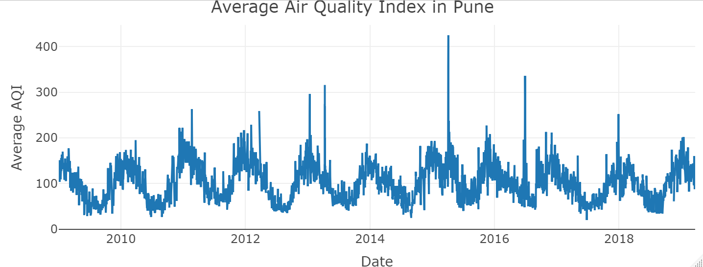
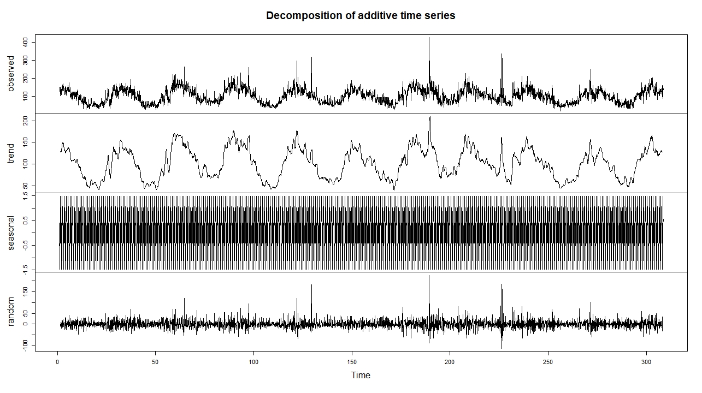

## Overiew

In this Application I try to Plot the trend of AQI in Pune. And plot using Plotly and Base plotting system.


### AQI

AQI transforms complex air
            quality data of various pollutants into a single index value which makes it easy to
            understand. Extent of air pollution and its severity can be mapped by calculating AQI for
            the respective air pollutants. Increase in AQI indicates increased air pollution and increased
            chances of threats associated with pollutants to human health.

## Diffrent Level of AQI
- (0-50)- good.
- (51-100)- satisfactory, might cause little discomfort while breathing.
- (101-200)- moderate pollution, might cause some lung diseases like asthma.
- (201-300)- bad, will cause even more discomfort may also develop heart problems.
- (301-400)- very bad, exposure to this air will cause severe damage and may need oxygen supply.
- (401-500)- hazardous, this will create worst effect on bodies long time exposure will reduce life spam.

### Link

- [Github Repo](https://github.com/Rishikesh0714/Pune-AQI-2009--2019)
- [Data](https://www.kaggle.com/prathmeshn/pune-air-quality-index)
- [Web App](https://rishikesh.shinyapps.io/Pune_Air_Quality_Index_AQI/)

## Cleaning data

### Raw Data
```{r reading, comment=""}
raw <- read.csv("Data/PNQ_AQI.csv")
clean <- read.csv("Data/Clean_AQI.csv")
head(raw)
```

There are 8 Columns and 7844 observations from 11 different locations.
This data is recorded between year 2009 to 2019
Problems in this data is there are two formats of date and it need to be cleaned . I cleaned that format also selected only AQI, Date, and Location columns for ploting as we don't need other columns we drop it.
You can whole cleaning code in github repo.
While ploting I also changed Location variable in usable format using make.names function

### Cleaned Data
```{r head, comment=""}
head(clean)
```


## Time series Plot

```{r, echo=FALSE}
   
```

As you can see there is sinusoidal trend in th data Next we can look at decompose of this time series.

## Decompose Plot

```{r, echo=FALSE}
   
```

Use App for looking Data from different location in Pune.
Above Plot's code could be found in github repo 

